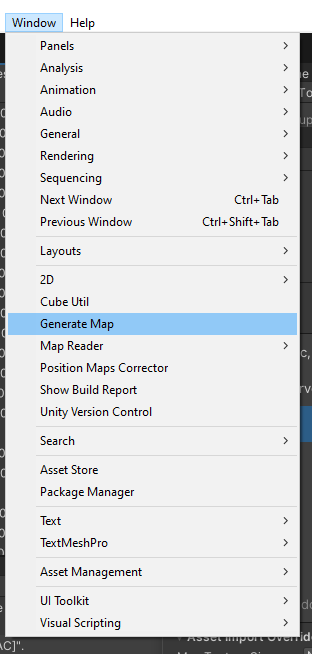

# Import Level Tutorial
This tutorial will guide you through the process of importing a level into the game.

## Pre-knowledge
Before you start, make sure you have the following knowledge:
- [Game Map](GameMap.md)

## Step 1: Convert the level to a JSON file
The first step is to convert the level from outside to a json map that game can understand.

You can look into the [Tap Unlock Block Level Reader](../com.ethnicthv/Editor/LevelCreator/TapUnlockBlockMapReader.cs) for an example of how to convert a level to a json file.

__IMPORTANT 1: Level need to be sorted in a category folder. (there is a default category - Normal)__
__IMPORTANT 2: After convert, you have to mark all the json as Addressable then build Addressable Bundle.__

## Step 2: Generate a Playable level
The next step is to generate a playable level from the json file.

- If you have a folder of levels, you can use the tool GenerateLevel in "Windows/GenerateLevel" to generate all levels in the folder.
  - Open the tool: 
  - Do what the tool says.
  - __Update Addressable!__
- If you have only one level, you can use the tool GenerateLevel in `LevelGenerator.scene` to generate the level.
  - Open the scene: 
  - Do what the tool says.
  - __Update Addressable!__

## Step 3: Correct the level's cube position
The generated level may not be in the correct position. You can use the tool `LevelPositionCorrector` to correct the position of the level.

